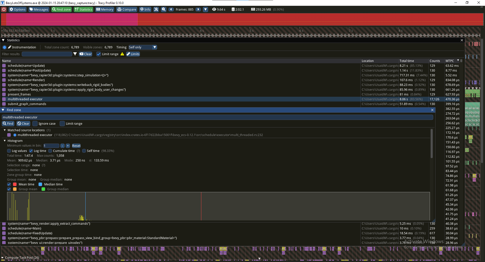

## Stress-test testing lots of Systems running in Bevy
#### Why?
I have a use-case where I need several simultaneous identical groups of entities running in parallel (same logic/systems, just independent of each other).
Clear use-case of subworlds, but Bevy's subworld support is not complete yet (1/15/24) and unfortunately Bevy does not 
have shared components such as Unity DOTS.

My solution was to use Rust generics to have a separate "marker" component tag per entity group. So `Marker::<0>`, `Marker::<1>`, 
and so on. Then for parallelisation (since we do not want systems to wait for unrelated groups to complete) I duplicate 
each system per-group using a proc_macro (RepeatMacro) for `reset_board::<0>`, `reset_board::<1>`, etc.

#### The Problem
Having so many systems seems to put strain on the multiprocess executor for Bevy. Having 2000 groups * 3 systems/group
(= 6000 systems) results in 12fps. 82% of the frame time is spent in Bevy's `multithreaded executor` according to Tracy.

Creating this Github to document the issue and maybe even document my solution (if I find one).

